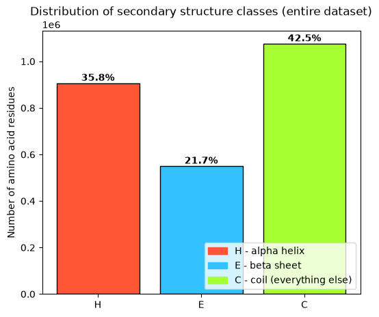
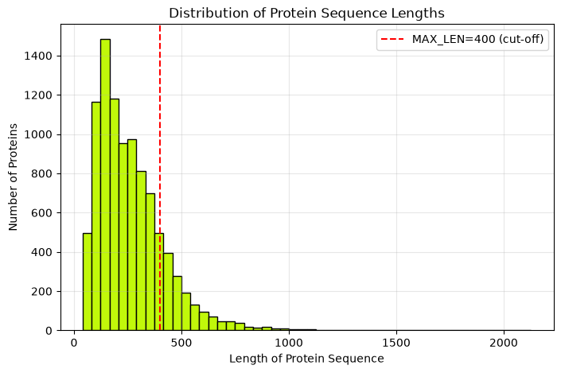
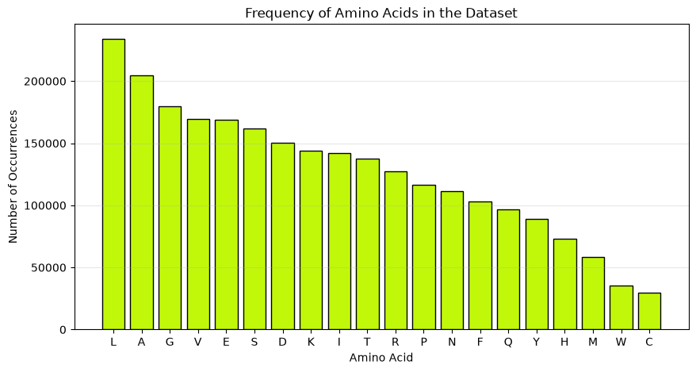
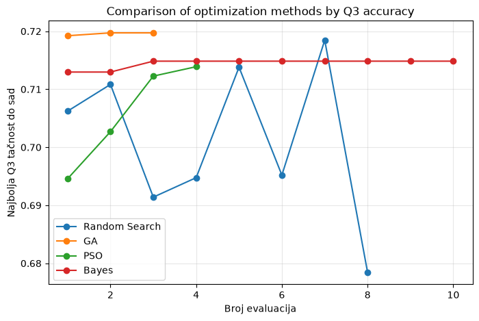
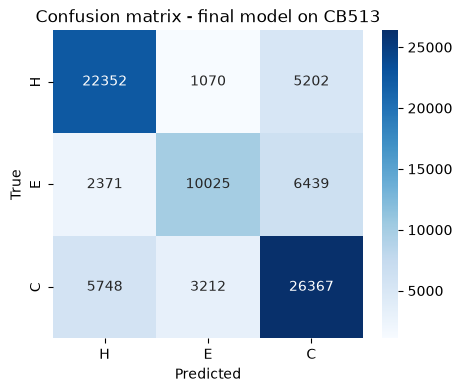

# Predikcija sekundarne strukture proteina primenom CNN+LSTM arhitekture i evolutivnih metoda optimizacije

**Autor:** Sara Stojkov, SV38/2023
**Predmet:** Računarska inteligencija

---

## Sadržaj

1. [Definicija problema](#1-definicija-problema)
2. [Skup podataka](#2-skup-podataka)
3. [Arhitektura modela](#3-arhitektura-modela)
4. [Metode optimizacije hiperparametara](#4-metode-optimizacije-hiperparametara)
5. [Struktura projekta](#5-struktura-projekta)
6. [Instalacija i pokretanje](#6-instalacija-i-pokretanje)
7. [Rezultati](#7-rezultati)
8. [Odstupanja od originalne specifikacije i obrazloženja](#8-odstupanja-od-originalne-specifikacije-i-obrazloženja)
9. [Predlozi za dalji rad](#9-predlozi-za-dalji-rad)
10. [Tehnologije](#10-tehnologije)
11. [Literatura](#11-literatura)

---

## 1. Definicija problema

Sekundarna struktura proteina opisuje lokalne geometrijske obrasce polipeptidnog lanca — α-heliks (H), β-ploču (E) i neuređene regione (coil, C). Predikcija sekundarne strukture je ključan međukorak između primarne sekvence aminokiselina i pune trodimenzionalne strukture proteina, sa direktnom primenom u razumevanju funkcije proteina, dizajnu lekova i proučavanju bolesti izazvanih pogrešnim savijanjem proteina (Alchajmerova, Parkinsonova bolest).

Problem je formulisan kao **sekvencna višeklasna klasifikacija** (sequence-to-sequence, 3 klase): za svaki aminokiselinski ostatak u sekvenci, model predviđa jednu od tri klase — H, E ili C.

Centralni doprinos projekta je sistematsko poređenje **četiri metode optimizacije hiperparametara** (Random Search, Genetski algoritam, PSO, Bayesova optimizacija) primenjenih na isti CNN+LSTM model, sa analizom kvaliteta rešenja, brzine konvergencije i računarskog troška svake metode.

Specifikacija i prezentacija projekta: https://github.com/sara-stojkov/Protein-Structure-Prediction/tree/main/docs 

---

## 2. Skup podataka

### Trening i validacija

Korišćen je skup **[Protein Secondary Structure 2022](https://www.kaggle.com/datasets/kirkdco/protein-secondary-structure-2022)** (Kaggle), konkretno fajl `2022-08-06-pdb-intersect-pisces_pc25_r2.5.csv` — proteini izdvojeni PISCES culling serverom uz ograničenje sekvencne sličnosti ≤25%, u skladu sa metodologijom originalnog CullPDB skupa.

- Ukupno **9646 proteina**
- Podela: **95% trening / 5% validacija** (`train_test_split`, `random_state=42`)
- Kolone od interesa: `seq` (sekvenca aminokiselina), `sst3` (labela sekundarne strukture u 3 klase), `len` (dužina sekvence)

### Test skup

**[CB513](https://www.kaggle.com/datasets/moklesur/cb513-dataset-for-protein-structure-prediction)** — nezavisni test skup od 513 proteina, korišćen isključivo za finalnu evaluaciju, nikada tokom treniranja ili podešavanja hiperparametara.


### Enkodiranje ulaza

Svaki aminokiselinski ostatak predstavljen je **one-hot vektorom dimenzionalnosti 21** (20 standardnih aminokiselina + 1 klasa za nepoznate/nestandardne ostatke, npr. `*` u sekvenci).

### Enkodiranje izlaza

Originalna SST-8 klasifikacija (8 tipova sekundarne strukture) redukovana je na **SST-3** prema standardnoj DSSP konvenciji:

| SST-8 | → | SST-3 |
|---|---|---|
| H (α-heliks), G (3-heliks), I (π-heliks) | → | **H** |
| E (β-traka), B (β-most) | → | **E** |
| S, T, C i ostalo | → | **C** |

### Maksimalna dužina sekvence

Na osnovu analize distribucije dužina (medijana ≈ 229, 75. percentil ≈ 342, maksimum 2128), usvojena je granica **MAX_LEN = 400**. Proteini duži od ove granice se skraćuju; kraći se popunjavaju (padding), uz binarnu masku koja obeležava validne pozicije i isključuje padding iz izračunavanja gubitka (loss) i svih metrika.

### Eksplorativna analiza podataka (EDA)







**Ključno zapažanje:** klasa C (coil) je dominantna (~42% ostataka), što je uzeto u obzir pri evaluaciji modela (praćenje F1 skora po klasi, ne samo ukupne Q3 tačnosti).

---

## 3. Arhitektura modela

Model kombinuje konvolutivne i rekurentne slojeve:

```
Ulaz (batch, seq_len, 21)
        ↓
Conv1D (kernel_size, "same" padding) → BatchNorm1D → ReLU → Dropout
        ↓
BiLSTM (dvosmeran)
        ↓
Dropout
        ↓
Fully Connected → Softmax
        ↓
Izlaz (batch, seq_len, 3)  →  raspodela verovatnoća H/E/C po ostatku
```

**Obrazloženje arhitekture:**
- **Konvolutivni blok** lokalno agregira kontekst susednih aminokiselina (prozor veličine 3-7), efikasno izdvajajući lokalne strukturne motive.
- **BiLSTM** modeluje dugoročne zavisnosti u sekvenci u oba smera — sekundarna struktura pojedinačnog ostatka zavisi i od udaljenijeg konteksta, ne samo neposrednih suseda.
- **Dropout** između slojeva sprečava overfitting.

Implementacija: `helpers/model.py` (`CNNLSTMModel`, PyTorch).

### Trening

- **Optimizator:** Adam
- **Funkcija gubitka:** Cross-Entropy sa maskiranjem padding pozicija (`ignore_index=-1`)
- **Fitness funkcija za optimizaciju hiperparametara:** Q3 tačnost na validacionom skupu

Implementacija: `helpers/train.py` (`train_model`).

---

## 4. Metode optimizacije hiperparametara

Pretražuje se prostor od 6 hiperparametara: broj konvolutivnih filtera, veličina konvolutivnog prozora, broj LSTM jedinica, stopa učenja, koeficijent dropout-a, veličina batch-a. Fitness funkcija je ista za sve algoritme — validaciona Q3 tačnost.

| Metoda | Princip | Implementacija |
|---|---|---|
| **Random Search** (baseline) | Nasumično uzorkovanje konfiguracija | `helpers/optimizers/random_search.py` — od nule |
| **Genetski algoritam (GA)** | Selekcija, ukrštanje, mutacija populacije konfiguracija | `helpers/optimizers/genetic_algorithm.py` — od nule |
| **PSO** | Roj čestica vođen ličnim i globalnim najboljim rešenjem | `helpers/optimizers/pso.py` — od nule |
| **Bayesova optimizacija** | Gaussian Process surogatni model fitness funkcije | `helpers/optimizers/bayesian_opt.py` — `scikit-optimize` (`gp_minimize`) |

Svi algoritmi izvršavaju **jednak broj evaluacija modela** (radi fer poređenja), sa istim opsegom hiperparametara (`PARAM_RANGES` u `random_search.py`).

---

## 5. Struktura projekta

```
Protein-Structure-Prediction/
│
├── data/
│   ├── 2022-08-06-pdb-intersect-pisces_pc25_r2.5.csv   # trening/validacija
│   └── CB513.npy                                        # nezavisni test skup
│
├── helpers/
│   ├── data_utils.py         # učitavanje, enkodiranje, train/val split
│   ├── model.py               # CNNLSTMModel arhitektura
│   ├── train.py                # trening petlja / fitness funkcija
│   ├── metrics.py              # Q3, F1 po klasi, konfuziona matrica
│   ├── visualize.py             # krive konvergencije, confusion matrix plot
│   └── optimizers/
│       ├── random_search.py
│       ├── genetic_algorithm.py
│       ├── pso.py
│       └── bayesian_opt.py
│
├── docs/
│   ├── RI_Specifikacija_Sara_Stojkov.pdf   # originalni predlog projekta
|   └── RI_Prezentacija_Sara_Stojkov.pdf   # prezentacija projekta za odbranu
│
├── PredikcijaStruktureProteina.ipynb   # glavni notebook (poziva helpers/)
├── requirements.txt
└── README.md
```

---

## 6. Instalacija i pokretanje

```bash
# kloniraj repozitorijum
git clone https://github.com/sara-stojkov/Protein-Structure-Prediction.git
cd Protein-Structure-Prediction

# instaliraj zavisnosti
pip install -r requirements.txt

# pokreni notebook
jupyter notebook PredikcijaStruktureProteina.ipynb
```

**Napomena:** za pokretanje CSV učitavanja obavezno preuzeti dataset sa Kaggle-a i smestiti u `data/` folder (nazivi fajlova moraju odgovarati onima u kodu, ili prilagoditi putanje u notebook-u). Linkovi do dataseta su na vrhu notebook-a.


---

## 7. Rezultati

### Poređenje optimizacionih algoritama


| Metoda | Najbolja Q3 tačnost (validacija) | Vreme izvršavanja |
|---|---|---|
| Random Search | 0.7185 | 60 min |
| Genetski algoritam | 0.7197 | 75 min |
| PSO | 0.7139 | 89 min |
| Bayesova optimizacija | 0.7148 | 67 min |



**Pobednička konfiguracija:** *[Genetic Algorithm] config: {'n_filters': 92, 'kernel_size': np.int64(5), 'lstm_units': 179, 'dropout': 0.2422478414286939, 'lr': 0.0016666563380906422, 'batch_size': np.int64(16)}
*

### Finalni model — evaluacija na CB513

CB513 Q3 accuracy: 0.7096

| Metrika | Vrednost |
|---|---|
| F1 tačnost (test) | |
| F1 - H | 0.756 |
| F1 - E | 0.605 |
| F1 - C | 0.72 |



---

## 8. Odstupanja od originalne specifikacije i obrazloženja

Zbog vremenskog ograničenja i nedostupnosti originalnog CullPDB5926 skupa podataka (uklonjen sa izvornih lokacija), napravljene su sledeće svesne izmene:

1. **Zamena trening skupa** - umesto CullPDB5926, korišćen je alternativni PISCES-culled skup (Protein Secondary Structure 2022, Kaggle), sa sličnom metodologijom prikupljanja (25% sekvencna sličnost).
2. **Bez PSSM profila** - ulaz je isključivo one-hot enkodiranje (21-dim) umesto pune 42-dim reprezentacije (one-hot + PSSM). PSSM profili zahtevaju pokretanje PSI-BLAST/HHblits alata nad sekvencama, što nije bilo izvodljivo bez predviđenog dataseta.
3. **Sužen opseg hiperparametara i manji broj evaluacija po optimizacionom algoritmu** radi vremenske izvodljivosti pretrage (trening na CPU, ne GPU).
4. **Manji broj epoha po evaluaciji tokom pretrage hiperparametara** (fitness funkcija) u odnosu na finalni trening - standardna praksa kod hyperparameter search-a pod vremenskim ograničenjem.

Sve navedene izmene ne menjaju suštinsku metodologiju i pristup definisan u originalnoj specifikaciji, već prilagođavaju obim eksperimenata raspoloživim resursima.

---

## 9. Predlozi za dalji rad

- Uključivanje PSSM profila (generisanih PSI-BLAST/HHblits) radi pune 42-dim reprezentacije ulaza, kako je predviđeno originalnom specifikacijom.
- Treniranje na GPU (Google Colab) radi omogućavanja više epoha i šireg opsega hiperparametara.
- Veći broj evaluacija po optimizacionom algoritmu i ponavljanje sa više random seed-ova radi statistički pouzdanijeg poređenja metoda.
- Dvostepena pretraga hiperparametara (grub opseg → fin opseg oko najboljeg regiona).
- Dublja arhitektura (dodatni konvolutivni/LSTM slojevi, multi-scale konvolucija) i/ili dodavanje mehanizma pažnje (attention) nakon BiLSTM sloja.
- Eksperimentisanje sa SST-8 klasifikacijom umesto redukovane SST-3.

---

## 10. Tehnologije

- **Python 3.10+**
- **PyTorch** — implementacija i treniranje CNN+LSTM arhitekture
- **NumPy** — manipulacija nizovima, implementacija GA i PSO od nule
- **scikit-learn** — metrike evaluacije (F1, konfuziona matrica)
- **scikit-optimize** — Bayesova optimizacija (`gp_minimize`)
- **Matplotlib / Seaborn** — vizualizacija
- **Jupyter Notebook**

---

## 11. Literatura

1. Zhou, J., & Troyanskaya, O. G. (2014). *Deep supervised and convolutional generative stochastic network for protein secondary structure prediction.* ICML 2014. [arxiv.org/abs/1403.1347](https://arxiv.org/abs/1403.1347)
2. Li, Z., & Yu, Y. (2016). *Protein Secondary Structure Prediction Using Cascaded Convolutional and Recurrent Neural Networks.* IJCAI 2016. [arxiv.org/abs/1604.07176](https://arxiv.org/abs/1604.07176)
3. Kennedy, J., & Eberhart, R. (1995). *Particle swarm optimization.* Proceedings of ICNN'95.
4. Holland, J. H. (1992). *Adaptation in Natural and Artificial Systems.* MIT Press.
5. Snoek, J., Larochelle, H., & Adams, R. P. (2012). *Practical Bayesian Optimization of Machine Learning Algorithms.* NeurIPS 2012. [arxiv.org/abs/1206.2944](https://arxiv.org/abs/1206.2944)
6. RCSB Protein Data Bank: [rcsb.org](https://www.rcsb.org/)

---